# C++ Trading System Architecture Diagram

> **Note**: This diagram uses Mermaid syntax and will render automatically on GitHub.

## System Architecture Overview

```mermaid
graph TB
    subgraph "External Systems"
        BINANCE[Binance Exchange]
        DERIBIT[Deribit Exchange]
        GRVT[GRVT Exchange]
    end

    subgraph "Trader Process"
        TRADER[Trader Main]
        STRAT_CONTAINER[StrategyContainer]
        STRATEGY[AbstractStrategy<br/>MarketMakingStrategy]
        MINI_OMS[MiniOMS<br/>Order State Management]
        MINI_PMS[MiniPMS<br/>Position Tracking]
        
        subgraph "ZMQ Adapters"
            ZMQ_OMS[ZmqOMSAdapter<br/>Order Events]
            ZMQ_MDS[ZmqMDSAdapter<br/>Market Data]
            ZMQ_PMS[ZmqPMSAdapter<br/>Position Updates]
        end
    end

    subgraph "Market Server Processes"
        MS_BINANCE[Market Server<br/>Binance]
        MS_DERIBIT[Market Server<br/>Deribit]
        MS_GRVT[Market Server<br/>GRVT]
        
        subgraph "Market Data Components"
            SUB_BINANCE[BinanceSubscriber<br/>Public WebSocket]
            SUB_DERIBIT[DeribitSubscriber<br/>Public WebSocket]
            SUB_GRVT[GrvtSubscriber<br/>Public WebSocket]
            PARSER[Exchange Parsers<br/>Binance/Coinbase]
            ZMQ_PUB_MD[ZMQ Publisher<br/>Market Data]
        end
    end

    subgraph "Trading Engine Processes"
        TE_BINANCE[Trading Engine<br/>Binance]
        TE_DERIBIT[Trading Engine<br/>Deribit]
        TE_GRVT[Trading Engine<br/>GRVT]
        
        subgraph "Trading Components"
            OMS_BINANCE[BinanceOMS<br/>Private WebSocket]
            OMS_DERIBIT[DeribitOMS<br/>Private WebSocket]
            OMS_GRVT[GrvtOMS<br/>Private WebSocket]
            HTTP_HANDLER[HTTP Handler<br/>CURL]
            ZMQ_PUB_OE[ZMQ Publisher<br/>Order Events]
            ZMQ_SUB_OR[ZMQ Subscriber<br/>Order Requests]
        end
    end

    subgraph "Position Server Processes"
        PS_BINANCE[Position Server<br/>Binance]
        PS_DERIBIT[Position Server<br/>Deribit]
        PS_GRVT[Position Server<br/>GRVT]
        
        subgraph "Position Components"
            PMS_BINANCE[BinancePMS<br/>Private WebSocket]
            PMS_DERIBIT[DeribitPMS<br/>Private WebSocket]
            PMS_GRVT[GrvtPMS<br/>Private WebSocket + REST]
            ZMQ_PUB_POS[ZMQ Publisher<br/>Position Updates]
        end
    end

    subgraph "Utilities & Infrastructure"
        LOGGER[Logging System<br/>Logger/LogManager]
        CONFIG[Config Manager<br/>ProcessConfigManager]
        APP_SVC[AppService<br/>Daemon/Stats]
        MONITOR[ExchangeMonitor<br/>Health/Performance]
    end

    %% External connections
    BINANCE -->|Market Data| SUB_BINANCE
    BINANCE -->|Orders/Account| OMS_BINANCE
    BINANCE -->|Positions| PMS_BINANCE
    
    DERIBIT -->|Market Data| SUB_DERIBIT
    DERIBIT -->|Orders/Account| OMS_DERIBIT
    DERIBIT -->|Positions| PMS_DERIBIT
    
    GRVT -->|Market Data| SUB_GRVT
    GRVT -->|Orders/Account| OMS_GRVT
    GRVT -->|Positions| PMS_GRVT

    %% Trader Process Internal
    TRADER --> STRAT_CONTAINER
    STRAT_CONTAINER --> STRATEGY
    STRAT_CONTAINER --> MINI_OMS
    STRAT_CONTAINER --> MINI_PMS
    STRAT_CONTAINER --> ZMQ_OMS
    STRAT_CONTAINER --> ZMQ_MDS
    STRAT_CONTAINER --> ZMQ_PMS
    
    STRATEGY -->|Order Requests| MINI_OMS
    MINI_OMS -->|Order State| STRATEGY
    MINI_PMS -->|Position Updates| STRATEGY

    %% Market Server Flow
    MS_BINANCE --> SUB_BINANCE
    MS_DERIBIT --> SUB_DERIBIT
    MS_GRVT --> SUB_GRVT
    
    SUB_BINANCE --> PARSER
    SUB_DERIBIT --> PARSER
    SUB_GRVT --> PARSER
    
    PARSER --> ZMQ_PUB_MD
    ZMQ_PUB_MD -->|Orderbooks/Trades| ZMQ_MDS

    %% Trading Engine Flow
    TE_BINANCE --> OMS_BINANCE
    TE_DERIBIT --> OMS_DERIBIT
    TE_GRVT --> OMS_GRVT
    
    ZMQ_SUB_OR -->|Order Requests| TE_BINANCE
    ZMQ_SUB_OR -->|Order Requests| TE_DERIBIT
    ZMQ_SUB_OR -->|Order Requests| TE_GRVT
    
    TE_BINANCE --> ZMQ_PUB_OE
    TE_DERIBIT --> ZMQ_PUB_OE
    TE_GRVT --> ZMQ_PUB_OE
    
    ZMQ_PUB_OE -->|Order Events| ZMQ_OMS
    ZMQ_OMS -->|Order Updates| MINI_OMS
    
    OMS_BINANCE --> HTTP_HANDLER
    OMS_DERIBIT --> HTTP_HANDLER
    OMS_GRVT --> HTTP_HANDLER

    %% Position Server Flow
    PS_BINANCE --> PMS_BINANCE
    PS_DERIBIT --> PMS_DERIBIT
    PS_GRVT --> PMS_GRVT
    
    PMS_BINANCE --> ZMQ_PUB_POS
    PMS_DERIBIT --> ZMQ_PUB_POS
    PMS_GRVT --> ZMQ_PUB_POS
    
    ZMQ_PUB_POS -->|Position Updates| ZMQ_PMS
    ZMQ_PMS -->|Position Updates| MINI_PMS

    %% Utilities
    TRADER --> LOGGER
    MS_BINANCE --> LOGGER
    MS_DERIBIT --> LOGGER
    MS_GRVT --> LOGGER
    TE_BINANCE --> LOGGER
    TE_DERIBIT --> LOGGER
    TE_GRVT --> LOGGER
    PS_BINANCE --> LOGGER
    PS_DERIBIT --> LOGGER
    PS_GRVT --> LOGGER
    
    TRADER --> CONFIG
    MS_BINANCE --> CONFIG
    TE_BINANCE --> CONFIG
    PS_BINANCE --> CONFIG
    
    TRADER --> APP_SVC
    MS_BINANCE --> APP_SVC
    TE_BINANCE --> APP_SVC
    PS_BINANCE --> APP_SVC
    
    TE_BINANCE --> MONITOR
    TE_DERIBIT --> MONITOR
    TE_GRVT --> MONITOR

    %% Styling
    classDef process fill:#e1f5ff,stroke:#01579b,stroke-width:2px
    classDef exchange fill:#fff3e0,stroke:#e65100,stroke-width:2px
    classDef zmq fill:#f3e5f5,stroke:#4a148c,stroke-width:2px
    classDef websocket fill:#e8f5e9,stroke:#1b5e20,stroke-width:2px
    classDef utility fill:#fce4ec,stroke:#880e4f,stroke-width:2px

    class TRADER,MS_BINANCE,MS_DERIBIT,MS_GRVT,TE_BINANCE,TE_DERIBIT,TE_GRVT,PS_BINANCE,PS_DERIBIT,PS_GRVT process
    class BINANCE,DERIBIT,GRVT exchange
    class ZMQ_OMS,ZMQ_MDS,ZMQ_PMS,ZMQ_PUB_MD,ZMQ_PUB_OE,ZMQ_PUB_POS,ZMQ_SUB_OR zmq
    class SUB_BINANCE,SUB_DERIBIT,SUB_GRVT,OMS_BINANCE,OMS_DERIBIT,OMS_GRVT,PMS_BINANCE,PMS_DERIBIT,PMS_GRVT websocket
    class LOGGER,CONFIG,APP_SVC,MONITOR utility
```



## Component Details

### Process Architecture

#### 1. Trader Process (Single Instance)
- **Purpose**: Core trading logic and strategy execution
- **Components**:
  - `StrategyContainer`: Manages strategy lifecycle and ZMQ adapters
  - `AbstractStrategy`: Base class for trading strategies
  - `MiniOMS`: Order state management and routing
  - `MiniPMS`: Position tracking and risk management
  - ZMQ Adapters: Communication with other processes

#### 2. Market Server (Per Exchange)
- **Purpose**: Real-time market data aggregation
- **Components**:
  - Exchange-specific subscribers (Binance/Deribit/GRVT)
  - Market data parsers
  - ZMQ publisher for orderbooks and trades
- **Data Flow**: Exchange WebSocket → Parser → ZMQ → Trader

#### 3. Trading Engine (Per Exchange)
- **Purpose**: Order execution and management
- **Components**:
  - Exchange-specific OMS (Order Management System)
  - HTTP handler for REST API calls
  - ZMQ subscriber for order requests
  - ZMQ publisher for order events
- **Data Flow**: Trader → ZMQ → Trading Engine → Exchange WebSocket/HTTP

#### 4. Position Server (Per Exchange)
- **Purpose**: Position and balance tracking
- **Components**:
  - Exchange-specific PMS (Position Management System)
  - ZMQ publisher for position updates
- **Data Flow**: Exchange WebSocket → Position Server → ZMQ → Trader

## Communication Patterns

### ZeroMQ (Inter-Process Communication)
- **Order Requests**: Trader → Trading Engine
- **Order Events**: Trading Engine → Trader
- **Market Data**: Market Server → Trader
- **Position Updates**: Position Server → Trader

### WebSocket (Exchange Communication)
- **Public Channels**: Market data (orderbooks, trades)
- **Private Channels**: Orders, positions, account updates

### HTTP (Exchange Communication)
- **REST API**: Order placement, cancellation, account queries
- **Authentication**: API key/signature management

## Exchange Integration Layers

Each exchange implements four interfaces:

1. **IExchangeSubscriber** (Market Server)
   - Public WebSocket streams
   - Orderbook and trade subscriptions

2. **IExchangeOMS** (Trading Engine)
   - Private WebSocket for orders
   - Order placement, cancellation, modification

3. **IExchangePMS** (Position Server)
   - Private WebSocket for positions
   - Position and balance updates

4. **IExchangeDataFetcher** (Trader - Startup)
   - HTTP REST API
   - Initial state recovery

## Data Flow Examples

### Order Execution Flow
```
Strategy → MiniOMS → ZmqOMSAdapter → ZMQ → Trading Engine → Exchange OMS → Exchange API
                                                                    ↓
Exchange → Exchange OMS → Trading Engine → ZMQ → ZmqOMSAdapter → MiniOMS → Strategy
```

### Market Data Flow
```
Exchange → Subscriber → Parser → Market Server → ZMQ → ZmqMDSAdapter → Strategy
```

### Position Update Flow
```
Exchange → PMS → Position Server → ZMQ → ZmqPMSAdapter → MiniPMS → Strategy
```

## Key Design Principles

1. **Multi-Process Architecture**: Each exchange runs separate processes for isolation
2. **ZMQ Communication**: High-performance inter-process messaging
3. **Dual Connectivity**: HTTP + WebSocket for redundancy
4. **Factory Pattern**: Exchange-specific implementations via factories
5. **Strategy Framework**: Pluggable strategy architecture
6. **Centralized Logging**: Structured logging with configurable levels

